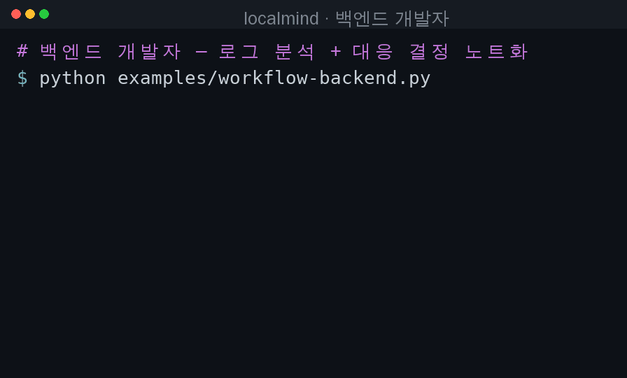
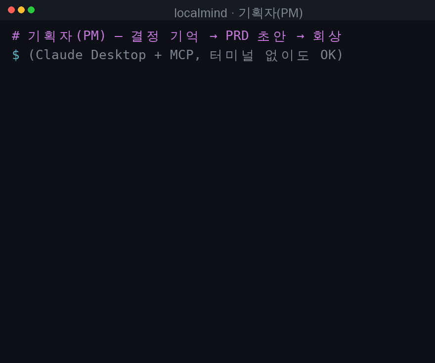
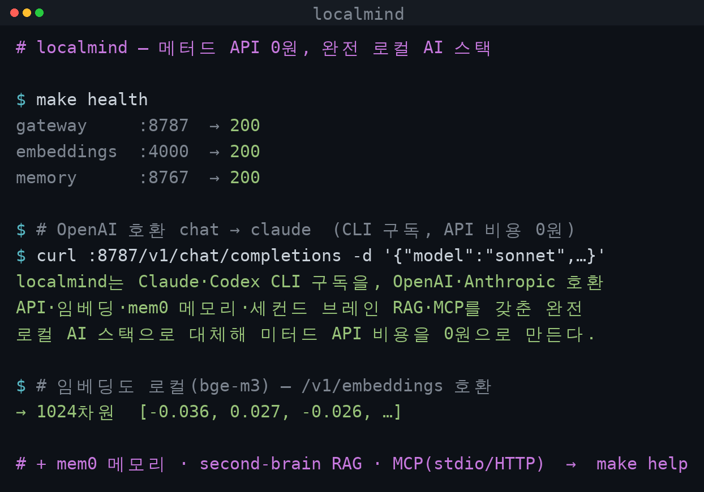

# localmind

[](https://github.com/shaul1991/localmind/actions/workflows/ci.yml)
[](LICENSE)

로컬 **Claude Code / Codex CLI 구독**을 토대로, **메터드 API 0원의 완결형 로컬 AI 스택**을 repo 하나로 제공합니다.
모든 것이 **로컬·독립 실행**(중앙 서버·공유 계정 의존 0)이며, OpenAI·Anthropic 호환 API + 임베딩 + mem0 메모리 + second-brain RAG + MCP를 한 번에 제공합니다.

- **LLM API** — OpenAI(`/v1/chat/completions`)·Anthropic(`/v1/messages`) 호환. 기존 코드의 `base_url`만 바꾸면 됨.
- **임베딩** — 로컬 bge-m3 (OpenAI `/v1/embeddings` 호환)
- **메모리** — mem0 (진화하는 사실 기억)
- **second-brain** — 내 마크다운 노트에 대한 RAG
- **MCP 도구** — Cursor/Claude Desktop/Cline에서 위 기능을 도구로 사용

> 🧩 **처음 보는 용어가 많다면** — 게이트웨이·임베딩·RAG·MCP를 **딱 하나의 비유**(내 컴퓨터 안의 1인 비서실)로 5분 만에 풀어주는 입문서부터: 👉 [비유로 이해하기](docs/concepts.md)
> ❓ **실사용자가 궁금해하는 것**(설치·Cursor 연동·백업·성능·약관 리스크)은 👉 [자주 묻는 질문(FAQ)](docs/faq.md)

> **개인 전용·독립 실행 원칙**: 이 스택은 **내 머신에서 나 혼자** 쓰는 용도입니다.
> 로컬 스택(gateway·임베딩·메모리·brain) + **내 `claude`/`codex` 로그인** + **localhost(루프백)** 로만
> 동작하며, **중앙 서버·공유 계정·원격 접속에 의존하지 않습니다**(단일 장애점·ToS 회피).

```
  HTTP API ┬─ /v1/chat/completions · /v1/messages   → claude/codex CLI
           ├─ /v1/embeddings                         → bge-m3
           └─ OpenMemory REST                        → mem0 + pgvector
  MCP ───── ask · remember/recall · capture_note/search_notes/ask_brain
```

## Quickstart

### 0) 전제
- Node.js ≥ 20, Docker
- **claude 구독 토큰** — 호스트에서 `make claude-token`(= `claude setup-token`, 브라우저 1회) 발급 후
  `.env`(`make init-env`)의 `CLAUDE_CODE_OAUTH_TOKEN=`에 붙여넣기. ~1년 장수명·자동 갱신 불필요.
- codex 백엔드를 쓰면 호스트에 로그인된 `codex` CLI (인증 `~/.codex`를 마운트해 재사용)

> 왜 토큰인가: `~/.claude.json`을 단일 파일로 bind-mount 하면 claude가 설정을 atomic rename으로
> 교체할 때마다 마운트 inode가 끊겨 컨테이너에서 "config not found"가 되고, macOS는 토큰을 **Keychain**에
> 저장해 파일 마운트만으로는 인증이 공유되지 않습니다. 헤드리스/컨테이너 정석인 `CLAUDE_CODE_OAUTH_TOKEN`이
> 두 문제를 모두 해결합니다.

### 1) 설치 & 기동
```bash
git clone https://github.com/shaul1991/localmind && cd localmind
make install build      # 의존성 + dist 빌드(로컬 MCP용)
make up                 # Docker 스택 기동(게이트웨이+메모리)
#   chat :8787 · 게이트웨이 :4000 · 메모리 :8767  (최초 빌드/모델 pull은 수 분)
```
> 운영은 전부 **`make`** 로 일관됩니다: `make up`(기동) · `make health`(점검) · `make logs` · `make down`. 전체 목록은 `make help`. (아래 문서의 `docker compose --profile ...`는 make가 실행하는 내부 명령으로, 세분 제어가 필요할 때 참고)

### 2) API로 쓰기 (base_url만 교체)
```bash
curl http://localhost:8787/v1/chat/completions -H "Content-Type: application/json" \
  -d '{"model":"sonnet","messages":[{"role":"user","content":"안녕"}]}'
```
OpenAI/Anthropic SDK는 `base_url`만 위 주소로 바꾸면 그대로 동작 → [사용 예시](#사용-예시).

### 3) MCP로 쓰기 (개인 두뇌)
Cursor `.cursor/mcp.json` / Claude Desktop `claude_desktop_config.json` / Cline MCP 설정에:
```json
{ "mcpServers": { "localmind": {
    "command": "node",
    "args": ["/절대경로/localmind/dist/mcp.js"],
    "env": { "NOTES_DIR": "/내/노트/폴더", "OPENMEMORY_USER": "내이름" }
}}}
```
→ 호스트가 `ask`·`remember/recall`·`capture_note/search_notes/ask_brain` 도구를 갖습니다.
`NOTES_DIR`를 기존 `.md` 노트 폴더(예: second-brain-mesh)로 가리키면 **그 지식으로 바로 RAG**.

### 4) 검증
```bash
make smoke              # API + MCP + brain 스모크 한 번에
make health             # 엔드포인트 상태(:8787 / :4000 / :8767)
```

> 더 가볍게: 채팅 API만 쓰려면 `docker compose up -d --build` (게이트웨이/메모리 프로파일 생략 — 이 경우만 raw).

## 온보딩 (개인 전용)

이 스택은 **내 PC에서 나 혼자** 쓰는 용도입니다(중앙 서버·공유 계정·원격 접속 없음).

**내 PC에서 바로 쓰기**
1. `git clone https://github.com/shaul1991/localmind && cd localmind`
2. `make init-env && make claude-token` → 출력된 토큰을 `.env`의 `CLAUDE_CODE_OAUTH_TOKEN=`에 붙여넣기 (codex 쓰면 호스트에서 `codex` 로그인)
3. `make install build && make up`
4. `make health`로 확인 → Cursor/Claude Desktop에 MCP 설정(아래 *MCP 서버* 섹션)
5. `NOTES_DIR`를 내 노트 폴더로 가리키면 그 지식으로 바로 RAG

> **메터드 API 0원**, 데이터는 전부 내 머신 로컬에만 둡니다.

📂 바로 따라 할 **케이스별 예제**는 [examples/](examples/) — API 대체·임베딩·메모리·second-brain·MCP까지.
👥 **내 직군에선 어떻게?** → [직군별 유즈케이스](examples/use-cases.md) — 개발(백엔드·프론트·앱·게임), 데이터/ML, QA·아키텍트·인프라, 비개발(PM·라이터·보안·연구자), **콘텐츠 크리에이터**(AI 글작성·유튜브 대본/편집·썸네일·인플루언서) 등 **19개 페르소나**.

## 🧑‍💻 직군별 워크플로우 — 내 직군, 바로 실행

`make up` 후 **내 직군 스크립트 하나만 돌리면** localmind 활용이 한 번에 체감됩니다. 전부 실행·검증됨.

| 그룹 | 바로 실행할 워크플로우 |
|---|---|
| **개발** | [백엔드](examples/workflow-backend.py) · [프론트](examples/workflow-frontend.mjs) · [앱/모바일](examples/workflow-mobile-i18n.py) · [게임](examples/workflow-game-content.py) |
| **데이터/ML** | [ML 엔지니어](examples/workflow-ml-index.py) · [데이터 분석](examples/workflow-data-analysis.py) |
| **품질·설계·운영** | [QA](examples/workflow-qa-testcases.py) · [아키텍트](examples/workflow-design-review.py) · [인프라/SRE](examples/workflow-infra-runbook.mjs) |
| **비개발** | [PM](examples/workflow-pm-spec.py) · [테크니컬 라이터](examples/workflow-docs-draft.mjs) · [보안](examples/workflow-security-triage.py) · [연구자](examples/workflow-research-synthesis.mjs) |
| **콘텐츠** | [AI 글작성](examples/workflow-ai-writer.py) · [유튜브 대본](examples/workflow-youtube-script.py) · [유튜브 편집](examples/workflow-youtube-edit.py) · [썸네일](examples/workflow-thumbnail-copy.py) · [인플루언서](examples/workflow-influencer-repurpose.py) |
| **1인 개발** | [풀스택 투어](examples/workflow-solo-stack.sh) |

각 직군의 **상황 → 활용 → 워크플로우 단계 → 효과**는 👉 [직군별 유즈케이스(19 페르소나)](examples/use-cases.md). 모든 예제는 [examples/](examples/).

### 실제 플로우 예시 — 어떻게 쓰고, 무엇이 쌓이는지
실행 중인 스택에 그대로 태운 두 직군. 응답·저장 데이터 모두 **실제 출력**입니다.

**백엔드 개발자** — 로그 요약 → 분류(perf) → 대응 결정을 노트로 적재 → `NOTES_DIR`에 **.md 정본이 쌓임**(이후 검색·RAG 대상)



**기획자(PM)** — 결정을 `remember`로 mem0에 저장 → PRD 초안 → 2주 뒤 `recall`로 **의미 회상**(결정·이유가 **기억으로 쌓임**)



## 동작 방식

1. OpenAI 형식 요청(`messages`, `stream`, ...)을 받습니다.
2. `model` 필드로 백엔드를 결정합니다 (claude vs codex).
3. `messages`를 시스템 프롬프트 + 단일 프롬프트로 평탄화해 해당 CLI를 `-p`/`exec` 비대화형 모드로 실행합니다.
4. CLI의 JSON/스트리밍 출력을 OpenAI 형식(`chat.completion` / `chat.completion.chunk` SSE)으로 변환해 돌려줍니다.

CLI는 **순수 텍스트 생성기**로 동작합니다 — claude는 `--tools ""`로 모든 내장 도구를 끄고, codex는 `-s read-only`로 격리하며, 둘 다 임시 디렉토리에서 실행해 프로젝트 설정(CLAUDE.md 등)이 섞이지 않습니다.

## 요구 사항

- Node.js >= 20
- claude 백엔드: `CLAUDE_CODE_OAUTH_TOKEN`(`make claude-token`으로 발급) — Docker 기동 시 필요
- 로그인된 `codex` CLI (codex 백엔드를 쓸 경우)
- (비-Docker 로컬 실행 시) 호스트에 직접 로그인된 `claude` CLI도 가능

## 설치 및 실행

```bash
make install            # 의존성

make dev                # 개발 모드(watch, 코드 변경 시 자동 재시작)

make build && npm start # 빌드 후 로컬 실행(비-Docker; npm start만 make 미대상)
```

기본적으로 `http://127.0.0.1:8787` 에서 대기합니다. 설정은 환경변수로 변경합니다 (`.env.example` 참고).

## Docker

이미지에는 `claude`·`codex` CLI가 함께 설치됩니다. 인증은 백엔드별로 다릅니다:
- **claude** — `.env`의 `CLAUDE_CODE_OAUTH_TOKEN`을 컨테이너에 주입(`make claude-token`으로 발급).
- **codex** — 호스트 `~/.codex`(파일 기반 auth)를 디렉터리째 마운트해 재사용.

> 전제: claude는 `make claude-token`으로 토큰을 발급해 `.env`에 넣고, codex는 호스트에서 미리 로그인(`~/.codex`).
> (claude는 macOS Keychain·atomic-rename 문제로 `~/.claude` 파일 마운트를 쓰지 않습니다 — 위 *0) 전제* 참고.)

### docker compose

```bash
docker compose up -d --build     # 채팅 API만(프로파일 생략) · 전체 스택은 `make up`
make health
```

`docker-compose.yml`이 호스트의 `~/.claude`, `~/.claude.json`, `~/.codex`를 컨테이너로 마운트합니다.

### docker run

```bash
docker build -t localmind .
docker run -d --name localmind -p 8787:8787 \
  -v "$HOME/.claude:/root/.claude" \
  -v "$HOME/.claude.json:/root/.claude.json" \
  -v "$HOME/.codex:/root/.codex" \
  localmind
```

**주의사항**
- 컨테이너 안의 CLI는 호스트와 **동일한 계정/인증/상태를 공유**합니다. 호스트에서 같은 CLI를 동시에 무겁게 쓰면 상태(히스토리·토큰 갱신 등)가 섞일 수 있습니다.
- 컨테이너 내부는 `HOST=0.0.0.0`으로 바인딩해야 외부에서 접근됩니다(이미지 기본값).
- claude는 glibc 네이티브 바이너리라 베이스 이미지는 Debian 계열(`node:24-slim`)을 사용합니다(alpine/musl 비호환).
- 인증 토큰 갱신을 컨테이너가 호스트 파일에 다시 쓰므로 볼륨은 읽기·쓰기로 마운트합니다.

## 임베딩까지 포함한 완전한 로컬 스택 (gateway 프로파일)

localmind는 채팅(생성)만 다룹니다 — CLI는 **임베딩**(텍스트→벡터)을 못 하기 때문입니다. 그래서 임베딩이 필요한 소비자(예: supermemory 같은 메모리/RAG 시스템)를 위해, **임베딩 서버(Ollama+bge-m3)** 와 **통합 게이트웨이(LiteLLM)** 를 opt-in 프로파일로 함께 제공합니다.

```
소비자 ──(base URL 하나)──▶ LiteLLM 게이트웨이 (:4000)
                              ├─ /v1/embeddings        → ollama (bge-m3)
                              └─ /v1/chat/completions  → localmind → claude/codex CLI
```

소비자는 **base URL 하나**(`http://<host>:4000/v1`)만 바라보면, 임베딩은 로컬 모델로·채팅은 CLI 구독으로 자동 분기됩니다.

### 기동

```bash
docker compose --profile gateway up -d --build   # 임베딩만(메모리 제외); 메모리까지 한 번에: make up
# 최초 1회: ollama가 bge-m3(~1.2GB)를 자동 pull (수 분 소요)
```

올라오는 서비스:
| 서비스 | 포트 | 역할 |
|---|---|---|
| `litellm` | 4000 | 통합 게이트웨이 (소비자가 바라보는 단일 엔드포인트) |
| `localmind` | 8787 | 채팅 (claude/codex CLI) |
| `ollama` | (내부) | 임베딩 백엔드 (bge-m3) |

### 소비자(supermemory 등) 연결

OpenAI 호환 클라이언트의 base URL/key만 게이트웨이로 바꿉니다.

```bash
OPENAI_BASE_URL=http://<host>:4000/v1
OPENAI_API_KEY=sk-local            # LITELLM_MASTER_KEY 값
EMBEDDING_MODEL=text-embedding-3-small   # 또는 bge-m3 (둘 다 bge-m3로 매핑됨)
```

```python
from openai import OpenAI
c = OpenAI(base_url="http://localhost:4000/v1", api_key="sk-local")

c.embeddings.create(model="text-embedding-3-small", input="의미 검색용 텍스트")  # → ollama bge-m3 (1024차원)
c.chat.completions.create(model="claude-sonnet-4-6",                            # → localmind → claude
    messages=[{"role": "user", "content": "안녕"}])
```

### 라우팅 규칙 (`litellm.config.yaml`)
- 임베딩 모델명(`text-embedding-3-small/large`, `ada-002`, `bge-m3`) → **ollama bge-m3**
- 그 외 모든 모델 → **localmind** (모델명으로 claude/codex 라우팅)
- 다른 임베딩 모델명을 쓰면 `litellm.config.yaml`의 `model_list`에 한 줄 추가하세요(없으면 채팅으로 잘못 라우팅됨).

### 주의
- **임베딩 모델 일관성**: 색인과 쿼리는 같은 임베딩 모델이어야 합니다. 모델을 바꾸면 전체 재색인이 필요합니다(벡터 차원도 bge-m3=1024로 맞출 것).
- `EMBEDDING_MODEL`/`LITELLM_MASTER_KEY`는 `.env`로 바꿀 수 있습니다.
- GPU가 있고 대량 색인이면 ollama 대신 HF TEI/Infinity 같은 임베딩 전용 서버로 `litellm.config.yaml`의 `api_base`만 바꿔도 됩니다.

## 메모리 서비스 (OpenMemory, memory 프로파일)

게이트웨이 위에 **OpenMemory(mem0)** 를 얹어, **메터드 API 0원**으로 동작하는 메모리/RAG 서비스를 바로 띄울 수 있습니다. OpenMemory의 **LLM(사실 추출)·임베더를 모두 게이트웨이로** 돌려 claude(또는 codex) + bge-m3로 동작합니다.

```
OpenMemory(:8767) ──▶ LiteLLM 게이트웨이
   │  add/list/search     ├─ 임베딩 → ollama(bge-m3)
   ▼                      └─ 추출 LLM → localmind → claude/codex CLI
 Postgres + pgvector (메타데이터 + 벡터)
```

> OpenMemory는 게시 이미지가 pgvector 미지원 + 읽기 버그가 있어, **최신 소스를 빌드하고 localmind 패치**(`openmemory/`)를 적용합니다. 저장소는 Postgres+pgvector 단일 DB로 통합합니다.

### 기동

```bash
make up   # = docker compose --profile gateway --profile memory up -d --build
# 최초 1회: OpenMemory 소스 빌드 + bge-m3(~1.2GB) pull (수 분)
# openmemory-init 사이드카가 자동으로:
#  - pgvector 테이블을 임베딩 차원(bge-m3=1024)에 맞춰 선생성
#  - LLM/임베더 모델을 게이트웨이 라우팅에 맞게 설정
```

올라오는 서비스: `openmemory`(:8767 REST), `mem0_pg`(Postgres+pgvector), `openmemory-init`(일회성 부트스트랩) + gateway 일체.

### 사용 (REST)

```bash
# 추가: claude가 사실을 추출해 저장 — user_id는 OPENMEMORY_USER 값
curl -X POST http://localhost:8767/api/v1/memories/ \
  -H "Content-Type: application/json" \
  -d '{"user_id":"localmind","text":"내 강아지 초코는 오이를 간식으로 좋아한다.","infer":true}'

# 목록 (키워드+최신순)
curl "http://localhost:8767/api/v1/memories/?user_id=localmind&size=20"

# 검색 (키워드 필터)
curl -X POST http://localhost:8767/api/v1/memories/filter \
  -H "Content-Type: application/json" \
  -d '{"user_id":"localmind","search_query":"강아지","size":10}'
```

의미 기반 회상(임베딩 벡터 검색)은 mem0 엔진으로:
```bash
docker exec localmind-openmemory python -c "
from app.utils.memory import get_memory_client
print(get_memory_client().search('반려견 간식', filters={'user_id':'localmind'}, limit=3))"
# → 의미 매칭 결과 (점수 높은 순)
```

### 검증된 동작 / 한계
- ✅ **쓰기**: REST 추가 → claude 사실 추출 → bge-m3 임베딩(1024) → pgvector 저장.
- ✅ **읽기**: `GET /memories`(목록)·`POST /memories/filter`(검색) 정상 동작 (소스 패치로 업스트림 읽기 버그 해소).
- ✅ **의미 회상**: mem0 엔진 `search()`가 게이트웨이로 임베딩해 의미 기반 검색.
- `user_id`는 `OPENMEMORY_USER`로 시드된 사용자여야 합니다(임의 id는 "User not found").
- **자동 카테고리화**(categorization)는 OpenAI 구조화 출력(json_schema)을 요구하는데 CLI 경로에선 강제가 안 되고 재시도가 워커를 막아 **비활성화**했습니다(메모리 기능엔 영향 없음).
- mem0 사실 추출 프롬프트는 기본이 영어("User owns ...")라, `openmemory/patch.py`에서 **입력과 같은 언어 + 주어 생략**으로 패치했습니다 → 한국어 입력은 "매일 아침 6시에 기상한다"처럼 자연스러운 한국어로 저장됩니다.
- OpenMemory는 단일 워커라 동시 add가 몰리면 직후 요청이 잠깐 밀릴 수 있습니다.
- 임베딩 모델을 바꾸면 `EMBEDDING_DIMS`도 맞추고 `make clean`(볼륨 삭제)으로 초기화하세요(차원이 테이블에 고정됨).

## 메모리 백업 (git)

mem0 메모리는 Postgres에 있어 그대로는 git-native가 아닙니다. **마크다운으로 export**해 git에 올려 백업합니다(메모리 1개당 한 줄 → diff가 깔끔). 노트(.md)는 이미 파일이라 그 자체로 git 백업되니, 이 둘이면 두뇌 전체가 git에 들어갑니다.

```bash
# 내보내기 (마크다운)
OPENMEMORY_USER=내이름 make memory-export FILE=~/brain/memory.md

# 백업: 노트 폴더(또는 백업 repo)에서 커밋·푸시
cd ~/brain && git add memory.md && git commit -m "memory backup" && git push

# 복원 (멱등 — 이미 있는 내용은 스킵)
OPENMEMORY_USER=내이름 make memory-import FILE=~/brain/memory.md
```

- export 출력은 `- <사실>` 한 줄씩이라 메모리 추가/삭제가 git diff에 1줄로 보입니다.
- import는 `infer:false`로 사실을 그대로 저장하고, **이미 있는 내용은 건너뜁니다**(여러 번 실행 안전).
- 파생물(pgvector/`.brain-index.json`)은 백업 불필요 — 노트·메모리에서 재생성됩니다.

### 자동 백업 (한 명령 + 스케줄)
위 과정을 `make backup` 하나로 묶습니다 — **메모리 export → 노트 백업 repo에 커밋·푸시**.

```bash
# 1) 백업 repo 준비(최초 1회): BACKUP_DIR이 git repo여야 함
git -C ~/.localmind init && git -C ~/.localmind remote add origin <내 private repo>

# 2) 한 번에 백업 (BACKUP_DIR 기본값 ~/.localmind)
make backup
#   BACKUP_DIR을 바꾸려면:  make backup BACKUP_DIR=~/brain
```
- 변경 없으면 커밋 생략, remote 없으면 로컬 커밋만 — **여러 번 돌려도 안전**.
- ⚠️ 백업 repo는 **반드시 Private**. `.env`(시크릿)는 `.gitignore`라 안 올라갑니다.

**주기 자동 실행** — `make backup-cron`이 붙여넣을 cron 한 줄을 출력합니다.
```bash
make backup-cron        # 예: 0 3 * * * cd /…/localmind && make backup >> ~/localmind-backup.log 2>&1
crontab -e              # 위 줄을 추가 (Linux). macOS는 cron 또는 launchd 모두 가능
```

### 새 기기 복구 (원커맨드)
컴퓨터를 바꾸거나 고장 후, **백업 repo 하나로 통째 복구**합니다.

```bash
git clone https://github.com/shaul1991/localmind && cd localmind
make recover RESTORE_REPO=<내 백업 repo url>
#   = 설치·빌드 → 스택 기동 → 헬스 대기 → 노트 clone + 메모리 import + 재인덱싱
```
- 이미 스택이 떠 있고 데이터만 되돌릴 땐 `make restore RESTORE_REPO=<url>` (또는 BACKUP_DIR이 이미 그 repo면 인자 없이 `make restore`).
- 복원 순서: **노트 repo pull/clone → `memory-import`(멱등) → 노트 재인덱싱**. 인덱스·DB는 파생이라 자동 재생성됩니다.
- 다중 노트 폴더를 쓴다면 폴더별 repo를 각각 복원하고 `NOTES_DIR`를 그에 맞게 지정하세요.

## MCP 서버 (도구로 사용)

localmind의 능력을 **MCP 도구**로 노출해, MCP 호스트(Claude Desktop / Cursor / Cline 등)가 자기 모델로 돌면서 끌어 쓰게 합니다. (MCP는 호스트의 *모델을 바꾸는 게 아니라* 도구를 줍니다.)

| 도구 | 설명 |
|---|---|
| `whoami` | 이 인스턴스 식별 — 어떤 메모리/노트를 쓰는지 |
| `ask` | claude/codex CLI에 교차 질의(다른 모델 상담) → localmind 경유 |
| `remember` | 진화하는 기억에 사실 저장 (mem0: claude 추출 + bge-m3) |
| `recall` | 의미 기반 회상 (mem0 벡터 검색) |
| `capture_note` | second-brain: 마크다운 노트 저장 + 인덱싱 (정본은 `.md`) |
| `search_notes` | second-brain: 내 노트 의미검색(원문·경로) |
| `ask_brain` | second-brain: 내 노트만 근거로 RAG 답변(출처 인용) |

> **두 종류의 기억**: `remember/recall`은 mem0의 *진화하는 사실 메모리*, `capture_note/search_notes/ask_brain`은 *내 마크다운 노트(정본) RAG* 입니다.

```
MCP 호스트(Claude Desktop/Cursor/Cline)
   │ stdio
   ▼
localmind MCP 서버 (dist/mcp.js)
   ├─ ask              → localmind :8787 (claude/codex)
   └─ remember/recall  → OpenMemory :8767 (pgvector)
```

### 준비
```bash
make install build      # dist/mcp.js 생성
make up                 # 스택 기동(게이트웨이+메모리)
#  - ask는 gateway 스택(:8787)만 있으면 동작
#  - remember/recall은 memory 스택(:8767)도 필요
```

### 호스트 설정 (stdio)
Claude Desktop `claude_desktop_config.json` (Cursor `.cursor/mcp.json`, Cline MCP 설정도 동일 구조):
```json
{
  "mcpServers": {
    "localmind": {
      "command": "node",
      "args": ["/절대경로/localmind/dist/mcp.js"],
      "env": { "OPENMEMORY_USER": "내이름" }
    }
  }
}
```

### 환경변수 (MCP 서버)
| 변수 | 기본값 | 설명 |
|---|---|---|
| `MCP_INSTANCE` | 호스트명 | 인스턴스 식별자(`OPENMEMORY_USER` 미설정 시 메모리 owner 기본값) |
| `LOCALMIND_URL` | `http://localhost:8787` | ask가 호출할 localmind |
| `LOCALMIND_API_KEY` | (없음) | localmind 인증 시 |
| `OPENMEMORY_URL` | `http://localhost:8767` | remember/recall 대상 |
| `OPENMEMORY_USER` | `localmind` | 메모리 소유자 id |
| `MCP_DEFAULT_MODEL` | `sonnet` | ask / ask_brain 기본 모델 |
| `NOTES_DIR` | `~/.localmind` | second-brain 노트 폴더(정본). **쉼표로 여러 폴더** 가능: `work=/notes/work,life=/notes/personal`(라벨 생략 시 폴더명, 선행 점 제거). 검색/RAG는 기본 전체, 도구의 `folder`로 한정 |
| `BRAIN_INDEX` | `<NOTES_DIR>/.brain-index.json` | 임베딩 인덱스 위치. git/싱크 볼트를 안 더럽히려면 밖으로 |
| `EMBEDDINGS_URL` | `http://localhost:4000/v1` | 노트 임베딩(게이트웨이) |
| `EMBEDDINGS_MODEL` | `text-embedding-3-small` | (게이트웨이가 bge-m3로 매핑) |
| `BRAIN_BATCH` / `BRAIN_CONCURRENCY` / `BRAIN_CHUNK_SIZE` | `32` / `4` / `2000` | 인덱싱 튜닝 |

> **인덱싱 성능**: 첫 인덱싱은 노트 전체를 임베딩하므로 시간이 걸리고(증분·resumable이라 이후엔 변경분만), bge-m3 CPU 임베딩이 바닥입니다. 더 빠르게:
> - **bge-m3 그대로 + GPU/전용 임베딩 서버(TEI/Infinity)** 로 `EMBEDDINGS_URL` 교체 (한국어 품질 유지하며 가속, 권장)
> - 더 가벼운 모델로 바꾸려면 **반드시 다국어 모델**(multilingual-e5, snowflake-arctic-embed2)을 — `nomic-embed-text` 등 **영어 전용 모델은 한국어 검색 품질이 크게 떨어집니다**.
> - 모델 변경 시 벡터 차원이 달라지므로 `EMBEDDING_DIMS` 조정 + 재인덱싱 필요.

검증: `make smoke`(MCP 포함 일괄).

## 사용 예시

> 🧩 **케이스별 runnable 예제 모음 → [examples/](examples/)** — API 대체(Python/Node/Anthropic), 함수호출, 임베딩·의미검색, 메모리, second-brain, LangChain, MCP(Cursor/Claude/Codex), 역할별 시나리오. 전부 실행·검증됨.

### curl

```bash
curl http://127.0.0.1:8787/v1/chat/completions \
  -H "Content-Type: application/json" \
  -d '{
    "model": "sonnet",
    "messages": [{"role": "user", "content": "안녕하세요"}]
  }'
```

### OpenAI Python SDK

```python
from openai import OpenAI

client = OpenAI(
    base_url="http://127.0.0.1:8787/v1",
    api_key="not-needed",   # LOCALMIND_API_KEY를 설정했다면 그 값
)

resp = client.chat.completions.create(
    model="sonnet",                       # → claude 백엔드
    messages=[{"role": "user", "content": "한 줄로 자기소개 해줘"}],
)
print(resp.choices[0].message.content)

# 스트리밍
for chunk in client.chat.completions.create(
    model="gpt-5.5",                      # → codex 백엔드
    messages=[{"role": "user", "content": "1부터 5까지 세줘"}],
    stream=True,
):
    print(chunk.choices[0].delta.content or "", end="")
```

### OpenAI Node SDK

```ts
import OpenAI from "openai";
const client = new OpenAI({ baseURL: "http://127.0.0.1:8787/v1", apiKey: "not-needed" });
const res = await client.chat.completions.create({
  model: "claude-sonnet-4-6",
  messages: [{ role: "user", content: "hello" }],
});
```

### Anthropic SDK (`/v1/messages`)

OpenAI뿐 아니라 공식 Anthropic SDK도 그대로 붙습니다. `base_url`만 localmind로 바꾸면 됩니다.

```python
from anthropic import Anthropic

client = Anthropic(
    base_url="http://127.0.0.1:8787",
    api_key="not-needed",   # LOCALMIND_API_KEY를 설정했다면 그 값 (x-api-key 헤더로 전송됨)
)

msg = client.messages.create(
    model="claude-sonnet-4-6",
    max_tokens=1024,
    system="간결하게 답해줘",
    messages=[{"role": "user", "content": "한 줄로 자기소개 해줘"}],
)
print(msg.content[0].text)

# 스트리밍
with client.messages.stream(
    model="sonnet",
    max_tokens=256,
    messages=[{"role": "user", "content": "1부터 5까지 세줘"}],
) as stream:
    for text in stream.text_stream:
        print(text, end="")
```

> `model`에 `codex:gpt-5.5` 처럼 지정하면 Anthropic 포맷으로 **codex 백엔드**를 호출할 수도 있습니다.

## 모델 라우팅

`model` 필드로 백엔드와 실제 모델을 결정합니다.

| 입력 `model` | 백엔드 | CLI 모델 |
|---|---|---|
| `sonnet`, `opus`, `haiku`, `claude-*` | claude | 그대로 전달 |
| `gpt-*`, `o1/o3/o4-*`, `codex`, `gpt-5.5` | codex | 그대로 전달 |
| `claude:<모델>` | claude (강제) | `<모델>` |
| `codex:<모델>` | codex (강제) | `<모델>` |
| `anthropic/<모델>`, `openai/<모델>` | 패턴 매칭 | 프리픽스 제거 후 전달 |
| 그 외/빈 값 | `DEFAULT_BACKEND` | 백엔드 기본 모델 |

> codex의 사용 가능 모델은 로그인 계정에 따라 다릅니다. 계정이 지원하지 않는 모델을 지정하면 400 오류가 반환됩니다. 기본값은 `~/.codex/config.toml`의 모델과 맞춰 두는 것을 권장합니다.

## 엔드포인트

| 메서드 | 경로 | 포맷 | 설명 |
|---|---|---|---|
| POST | `/v1/chat/completions` | OpenAI | 채팅 완성 (스트리밍/비스트리밍) |
| POST | `/v1/messages` | Anthropic | 메시지 (스트리밍/비스트리밍) |
| GET | `/v1/models` | OpenAI | 모델 목록 |
| GET | `/health` | — | 헬스체크 (인증 불필요) |

인증(`LOCALMIND_API_KEY` 설정 시)은 OpenAI식 `Authorization: Bearer <키>` 와 Anthropic식 `x-api-key: <키>` 헤더를 모두 허용합니다.

## 세션 영속화 (컨텍스트 유지)

OpenAI/Anthropic API는 stateless라 보통 매 요청마다 전체 대화 히스토리를 다시 보냅니다. localmind는 대화를 **CLI 세션에 매핑**해, 이어지는 요청에서는 `claude --resume` / `codex exec resume`로 **새 턴만 전송**합니다. 결과적으로 CLI 측 컨텍스트와 프롬프트 캐시를 활용해 토큰을 아낍니다.

`SESSION_MODE`로 동작을 정합니다.

| 모드 | 동작 |
|---|---|
| `auto` (기본) | 메시지 prefix를 해시로 자동 인식. **클라이언트 코드 변경 불필요** — 일반적인 "히스토리를 계속 append하는" 채팅이면 자동으로 이어집니다. |
| `explicit` | `x-localmind-session` 헤더(또는 `session_id`/`user`/`metadata.user_id` 필드)가 있을 때만 해당 id로 세션을 잇습니다. 가장 견고합니다. |
| `off` | 세션 없이 항상 전체 히스토리 전송. |

```bash
# explicit 모드 예: 같은 세션 id로 요청하면 컨텍스트가 이어짐
curl http://127.0.0.1:8787/v1/chat/completions \
  -H "Content-Type: application/json" \
  -H "x-localmind-session: my-convo-1" \
  -d '{"model":"sonnet","messages":[{"role":"user","content":"내 이름은 지훈이야"}]}'
```

**auto 모드 주의점**
- 클라이언트가 우리가 준 assistant 응답을 **그대로 다시 보낼 때** prefix가 일치해 이어집니다. 응답을 편집/요약해서 보내면 매칭이 깨지고, 이 경우 안전하게 **전체 히스토리로 새 세션을 다시 만듭니다**(틀린 답이 나오지는 않고, 토큰 절약만 사라짐).
- **재생성(regeneration)·분기 안전**: 같은 prefix가 두 번 오면 첫 번째만 resume하고(consume-once), 두 번째는 fresh로 복구해 세션 오염을 막습니다.
- 세션 매핑은 인메모리이며 서버 재시작 시 사라집니다(`SESSION_TTL_MS` 경과 시에도 만료). 그래도 컨텍스트는 항상 클라이언트가 보낸 히스토리로 복구 가능합니다.

## 함수 호출 (Function Calling, A2 프롬프트 방식 PoC)

OpenAI(`/v1/chat/completions`)와 Anthropic(`/v1/messages`) **양쪽** 모두 함수 호출을 지원합니다. 모델이 함수 호출이 필요하다고 판단하면 각 포맷의 표준 응답(OpenAI `tool_calls` / Anthropic `tool_use` 블록)을 돌려줍니다. 공식 OpenAI/Anthropic SDK의 함수 호출 흐름이 그대로 동작합니다.

### OpenAI (`/v1/chat/completions`)

```python
tools = [{
    "type": "function",
    "function": {
        "name": "get_weather",
        "description": "Get current weather for a city",
        "parameters": {"type": "object", "properties": {"city": {"type": "string"}}, "required": ["city"]},
    },
}]

# 1) 모델이 도구 호출을 결정
r = client.chat.completions.create(model="sonnet", tools=tools,
    messages=[{"role": "user", "content": "서울 날씨 알려줘"}])
call = r.choices[0].message.tool_calls[0]      # get_weather({"city":"서울"})

# 2) 함수를 실행하고 결과를 다시 전달 → 모델이 최종 답변
r2 = client.chat.completions.create(model="sonnet", tools=tools, messages=[
    {"role": "user", "content": "서울 날씨 알려줘"},
    r.choices[0].message,
    {"role": "tool", "tool_call_id": call.id, "content": "맑음, 25도"},
])
print(r2.choices[0].message.content)
```

### Anthropic (`/v1/messages`)

Anthropic 포맷(`tools`는 `{name, description, input_schema}`, 결과는 `user` 메시지의 `tool_result` 블록)도 그대로 지원합니다.

```python
tools = [{
    "name": "get_weather",
    "description": "Get current weather for a city",
    "input_schema": {"type": "object", "properties": {"city": {"type": "string"}}, "required": ["city"]},
}]

r = client.messages.create(model="sonnet", max_tokens=1024, tools=tools,
    messages=[{"role": "user", "content": "서울 날씨 알려줘"}])
tool_use = next(b for b in r.content if b.type == "tool_use")   # get_weather(input={"city":"서울"})

r2 = client.messages.create(model="sonnet", max_tokens=1024, tools=tools, messages=[
    {"role": "user", "content": "서울 날씨 알려줘"},
    {"role": "assistant", "content": r.content},
    {"role": "user", "content": [{"type": "tool_result", "tool_use_id": tool_use.id, "content": "맑음, 25도"}]},
])
print(r2.content[0].text)
```

**작동 방식 (A2)**: CLI에는 "외부가 실행할 함수 스펙을 받아 호출만 내뱉고 멈추는" 모드가 없으므로, `tools` 스펙을 시스템 프롬프트에 주입하고 모델이 약속된 JSON(`{"tool_calls":[...]}`)으로 출력하게 한 뒤 그 텍스트를 파싱해 각 포맷의 `tool_calls`/`tool_use`로 변환합니다.

**한계 (PoC)**
- **프롬프트 기반이라 100% 보장은 아님**: 모델이 형식을 벗어나면 도구 호출로 인식되지 않고 일반 텍스트로 처리됩니다.
- **스트리밍 시 버퍼링**: 도구 호출 여부는 전체 출력을 봐야 알 수 있어, `tools`가 있으면 전체를 모은 뒤 한 번에 방출합니다(토큰 단위 스트리밍 아님). `tools`가 없으면 기존대로 실시간 스트리밍.
- **백엔드 특성 차이**: claude는 `--tools ""`로 순수 텍스트화되어 주입한 도구 결과를 충실히 따릅니다. **codex는 더 에이전트적**이라 자체 도구(웹 검색 등)를 써서 주입한 결과와 다른 답을 낼 수 있습니다.
- 멀티스텝 도구 루프에서 컨텍스트 유지는 [세션 영속화](#세션-영속화-컨텍스트-유지)를 따릅니다(매칭 안 되면 전체 히스토리로 복구).

## 설정 (환경변수)

| 변수 | 기본값 | 설명 |
|---|---|---|
| `PORT` | `8787` | 포트 |
| `HOST` | `127.0.0.1` | 바인딩 호스트 |
| `LOCALMIND_API_KEY` | (없음) | 설정 시 `Authorization: Bearer <키>` 필수 |
| `DEFAULT_BACKEND` | `claude` | 라우팅 실패 시 기본 백엔드 |
| `CLAUDE_DEFAULT_MODEL` | `sonnet` | claude 기본 모델 |
| `CODEX_DEFAULT_MODEL` | `gpt-5.5` | codex 기본 모델 |
| `CLAUDE_BIN` | `claude` | claude 실행 파일 경로 |
| `CODEX_BIN` | `codex` | codex 실행 파일 경로 |
| `REQUEST_TIMEOUT_MS` | `300000` | 요청 타임아웃(ms) |
| `SESSION_MODE` | `auto` | 세션 영속화 모드 (`off`/`explicit`/`auto`) |
| `SESSION_TTL_MS` | `3600000` | 세션 매핑 보관 시간(ms) |
| `SESSION_MAX` | `1000` | 세션 매핑 최대 개수 |
| `LOG_LEVEL` | `info` | `debug`/`info`/`warn`/`error` |

## 검증

기본 묶음은 **`make smoke`**(API+MCP+brain). 아래는 백엔드·엔드포인트별 세분 변형으로, make 타겟이 없어 `npm run`을 직접 씁니다.

```bash
make dev                             # 다른 터미널에서 서버 실행

# OpenAI 엔드포인트(/v1/chat/completions)
MODEL=sonnet  npm run smoke          # claude 백엔드
MODEL=gpt-5.5 npm run smoke          # codex 백엔드

# Anthropic 엔드포인트(/v1/messages)
MODEL=sonnet        npm run smoke:anthropic   # claude 백엔드
MODEL=codex:gpt-5.5 npm run smoke:anthropic   # codex 백엔드

# 함수 호출
MODEL=sonnet npm run smoke:tools             # OpenAI tools
MODEL=sonnet npm run smoke:anthropic:tools   # Anthropic tool_use
```

## 문제 해결 (Troubleshooting)

| 증상 | 원인 / 해결 |
|---|---|
| 채팅 호출이 실패/빈 응답(claude `Not logged in`/`config not found`) | `.env`의 `CLAUDE_CODE_OAUTH_TOKEN` 미설정/만료 → `make claude-token`으로 재발급해 `.env`에 넣고 **`make up`**(컨테이너 recreate; `make restart`는 env 재주입 안 됨). `make secrets`로 설정 여부 확인. (codex는 호스트 `~/.codex` 로그인 필요) |
| `make health`에서 일부 `000`/비정상 | 첫 기동은 모델 pull(bge-m3 ~1.2GB) + OpenMemory 소스 빌드로 **수 분** 걸림 → `make logs`로 진행 확인. 부하 중 임베딩이 멈추면 `make restart`. |
| 포트 충돌(8787/4000/8767) | 이미 쓰는 포트면 `.env`/compose에서 변경하거나 충돌 프로세스 정지. |
| 메모리 `User not found` | `user_id`는 **시드된 사용자**(`OPENMEMORY_USER`/`MCP_INSTANCE`)여야 함. 임의 id 불가. |
| 노트 첫 인덱싱이 느림 | bge-m3 CPU 임베딩이 바닥(이후 증분이라 빠름). 급하면 GPU/TEI로 `EMBEDDINGS_URL` 교체. 한국어면 **다국어 모델만**(nomic 등 영어 전용 금지). |
| 임베딩 모델 변경 후 차원 오류 | `EMBEDDING_DIMS` 맞추고 `make clean`(볼륨 초기화) 후 재기동. |

## CI

GitHub Actions(`.github/workflows/ci.yml`)에서 push/PR마다 다음을 검증합니다.

- **typecheck & build**: Node 20·22·24 매트릭스로 `npm ci → typecheck → build`
- **docker build**: 이미지가 정상 빌드되는지 확인

> 스모크 테스트(`npm run smoke*`)는 인증된 `claude`/`codex` CLI가 필요해 CI에서는 실행하지 않습니다. 로컬에서 서버를 띄운 뒤 수동으로 돌리세요.

## 현재 제한 사항 (MVP)

- **Function calling / tools**: OpenAI·Anthropic 양쪽 엔드포인트에서 [A2 프롬프트 방식 PoC](#함수-호출-function-calling-a2-프롬프트-방식-poc)로 지원.
- **멀티모달**: 이미지 등 비텍스트 입력은 자리표시자로 치환됩니다.
- **대화 맥락**: 세션 영속화(위 참고)로 CLI 세션을 resume합니다. 매칭이 안 되거나 `SESSION_MODE=off`면 멀티턴 `messages`를 `User:/Assistant:` 라벨로 평탄화해 전체 전달합니다.
- **토큰 수**: CLI가 보고하는 값을 그대로 전달하므로, CLI 내부 시스템 프롬프트 토큰이 `prompt_tokens`(`input_tokens`)에 포함됩니다.
- `temperature`, `max_tokens` 등 일부 샘플링 파라미터는 CLI가 지원하지 않아 무시될 수 있습니다.
- **Anthropic 스트리밍**: `input_tokens`는 스트림 시작 시점(`message_start`)에 0으로 보내고, 최종 `message_delta`에서 실제 값을 채웁니다(SDK가 이를 합산해 최종 usage를 계산).

## 데모

실제 실행 중인 스택의 세션입니다 — `make health` → OpenAI 호환 chat(claude) → 로컬 임베딩(bge-m3). 전부 **메터드 API 0원**, 완전 로컬. (응답·임베딩 값 모두 실제 출력)



> 직접 보려면 `make up` 후 위 명령들을 그대로 실행하면 됩니다.

## 라이선스

[MIT](LICENSE)
