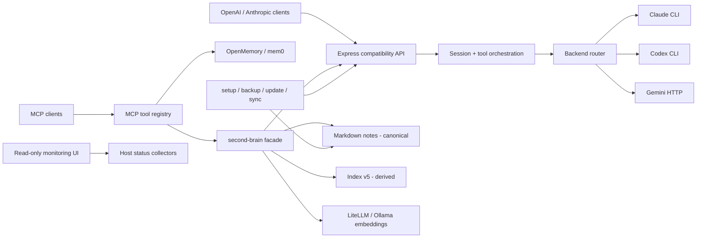

# localmind 아키텍처·비즈니스 로직 감사 (2026-07)

> 상태: 조사 완료, 개선 구현 전
>
> 이 문서는 2026-07-10의 저장소 `main`(`aa13cfb`)과 로컬 관측 자료를 기준으로 한다.
> 프로덕션 코드는 변경하지 않았으며, 후속 구현 계약은 `specs/041`~`043`이 소유한다.

## 1. 요약

localmind의 핵심 경계는 이미 분명하다. 호환 API가 Claude/Codex/Gemini 백엔드를 감싸고,
MCP가 메모리(OpenMemory)와 마크다운 second-brain을 도구로 노출하며, 노트 파일은 정본이고
임베딩 색인은 재생성 가능한 파생물이다. 특히 색인 원자 저장, 다중 프로세스 병합, 프루닝 가드,
페르소나 레지스트리의 managed-file 보호는 로컬 우선 제품의 위험을 구체적으로 다룬 좋은 결정이다.

다만 다음 세 문제가 제품 가치와 변경 안전성을 직접 제한한다.

1. **검색의 "결과 반환"이 "관련성 성공"으로 기록된다.** 비어 있지 않은 vault에서는 무관한
   질문도 상위 k개를 돌려주므로 현재 성공률은 검색 품질을 나타내지 않는다.
2. **second-brain 책임이 `src/brain.ts` 한 모듈에 집중됐다.** 색인 저장 형식, 동시성, 스캔,
   검색, 캡처, RAG, 페르소나 검증, 관측 로깅이 같은 상태 공간을 공유한다.
3. **OpenAI·Anthropic 호환 라우트가 같은 실행 파이프라인을 중복 보유한다.** 모델·system·tools가
   바뀐 세션의 resume 자격도 하나의 명시적 계약으로 묶여 있지 않다.

권고 순서는 **측정 계약(041) -> second-brain 책임 분해(042) -> completion 코어 통합(043)** 이다.
측정 없이 BM25/RRF/MMR/고정 임계값을 먼저 채택하지 않는다.

## 2. 조사 범위와 근거

### 2.1 조사한 표면

- 런타임: `src/`, backend adapters, API routes, MCP server, UI status collectors
- 데이터: note folder 해석, index v5 JSON+binary sidecar, query log, OpenMemory 경계
- 운영: Docker Compose, backup/recovery/update/device-sync, CI, SDD 001~040
- 검증: 타입체크, 테스트 구성, 최근 쿼리 로그 집계, `src`와 `dist` 생성 시각
- 과거 결정: second-brain MCP의 domain brief와 vector DB 보류 ADR

아키텍처 도메인 가이드(`$HOME/.localmind/guides/architecture.md` 또는 `architect.md`)는 없었다.
따라서 이 감사는 localmind의 SDD 문서와 일반적인 경계·상태 소유 원칙을 따른다. 존재한
`guides/backend.md`는 이번 문서 전용 아키텍처 가이드가 아니므로 정본으로 적용하지 않았다.

### 2.2 검증 기준선

| 확인 | 결과 | 해석 |
|---|---|---|
| `git status --short --branch` | `main...origin/main`, 사용자 `Makefile` 변경 1건 | 감사 문서가 해당 변경을 건드리면 안 됨 |
| `npm run typecheck` | 통과 | 현재 TypeScript 정적 타입 기준선 green |
| `npm test` | 완주하지 못함 | sandbox가 loopback/Unix socket listen을 `EPERM`으로 막아 bootstrap 통합 테스트 실패 후 장기 대기; 저장소 결함으로 단정하지 않음 |
| `node --import tsx/esm scripts/query-report.ts` | 30일 53검색, 결과 반환률 100%, capture 12/12 confirmed | 현재 이진 성공 지표는 품질 변별력이 없음 |
| query log schema | `topScore` 보유 검색 0건 | 025 관측 코드의 실사용 데이터가 아직 없음 |
| build freshness | `dist/brain.js` 2026-07-04, `src/brain.ts` 2026-07-08 | 파생 build가 source보다 오래됐고 실행 버전을 식별할 표면이 없음 |

`npm run query-report` 자체는 이 sandbox에서 `tsx` IPC pipe listen이 거부돼 실패했지만, 동일
진입점을 Node loader로 실행하면 정상 집계됐다. 이는 운영 스크립트 결함이 아니라 조사 환경 제약이다.

## 3. 현재 아키텍처

### 3.1 경계별 책임

| 경계 | 현재 소유 | 평가 |
|---|---|---|
| Compatibility API | `server.ts`, `routes/chat.ts`, `routes/messages.ts` | 프로토콜 렌더와 실행 오케스트레이션이 혼재 |
| Backend adapters | `backends/*`의 `Backend` 계약 | Claude/Codex/Gemini 차이를 비교적 잘 격리 |
| Session | `session.ts` | prefix 안전성은 강하지만 model/system 호환 서명이 불완전 |
| second-brain | `brain.ts` | 정본/파생물 원칙은 좋으나 책임·상태가 과집중 |
| Memory | 외부 OpenMemory + `mcp-server.ts` HTTP 호출 | 배포 경계는 분리됐으나 client/handler 책임이 섞임 |
| Persona runtime | `agents/*` | 레지스트리·배포·런타임 선택이 분리됨 |
| Observability | `query-analysis.ts`, query log, UI collectors | 계산 모듈은 분리됐지만 성공 의미가 약함 |
| Operations | `Makefile`, `scripts/*.sh`, Compose | 기능은 폭넓지만 오케스트레이션 정책이 여러 셸 파일에 분산 |

### 3.2 핵심 흐름

**Capture**: MCP `capture_note` -> 파일 배타 생성 -> 선택적 curator 태깅 -> 전체 vault 변경 감지
-> 변경 파일 임베딩 -> index 저장 -> index key 존재 확인 -> validation 상태와 query event 반환.

**Search/RAG**: 질문 임베딩 -> 모든 chunk cosine 계산 -> 상위 k개 -> `search_notes`는 그대로 반환,
`ask_brain`은 context 합성 -> librarian 선택 -> gateway completion -> critic 교차 검증 -> 단일 query event.

**Completion**: 프로토콜 요청 정규화 -> backend/model 해석 -> 세션 resume 판단 -> tools prompt 주입
-> backend async generator -> protocol별 SSE/JSON 렌더 -> session commit.

## 4. 주요 발견

### AUD-001 - 결과 반환을 관련성 성공으로 간주한다 (Major)

**근거**

- `searchNotesInternal()`은 모든 chunk의 cosine을 정렬해 임계 없이 `slice(0, limit)` 한다
  (`src/brain.ts:1103-1121`).
- `searchNotes()`는 결과 길이가 1 이상이면 `success:true`로 기록한다(`src/brain.ts:1085-1097`).
- `askBrain()`도 검색 source가 있으면 합성 실패 여부와 무관하게 성공으로 기록할 수 있다
  (`src/brain.ts:1431-1489`).
- 최근 로컬 집계는 53건 모두 성공이지만 relevance label이나 score 표본은 0건이다.

**영향**

- 무관한 질문도 "성공"으로 집계돼 노트 갭과 소프트 실패가 사라진다.
- `ask_brain`이 무관한 청크를 context로 넣고도 출처 있는 답변처럼 보일 수 있다.
- 검색 알고리즘 변경 전후를 비교할 신뢰 가능한 기준선이 없다.

**권고**: `specs/041-retrieval-quality-contract`. 먼저 결과 반환과 품질 판정을 분리하고 고정
평가셋을 만든다. 측정 결과가 사전 게이트를 넘기 전에는 임계값이나 새 ranker를 기본화하지 않는다.

### AUD-002 - 실행 중인 코드의 출처와 freshness를 판별할 수 없다 (Major)

**근거**

- package와 MCP server version은 모두 고정 문자열 `0.2.0`이며 commit/build id가 없다
  (`package.json`, `src/mcp-server.ts:48-50`).
- 현재 `dist/brain.js`는 최신 `src/brain.ts`보다 오래됐다.
- 025 구현 이후 시각의 검색 로그에도 `topScore`가 없어, 오래된 build 또는 장수 MCP 프로세스가
  사용됐을 가능성이 있다. 이는 정황이며 실행 프로세스 자체를 이번 조사에서 단정하지 않는다.

**영향**

- 사용자는 수정이 반영됐는지 `whoami`, UI, health에서 확인할 수 없다.
- 품질 회귀가 source 문제인지 배포 freshness 문제인지 구분하기 어렵다.

**권고**: 후속 backlog. build SHA/source timestamp/index schema/query schema를 health·whoami·UI에
노출하고, source보다 오래된 dist를 `make update`/CI에서 감지한다. 시크릿과 개인 경로는 노출하지 않는다.

### AUD-003 - `brain.ts`가 너무 많은 상태와 정책을 소유한다 (Major)

**근거**

`src/brain.ts` 1,809줄 안에 다음이 함께 있다.

- folder/env 파싱과 module-load 전역 상태(`:26-92`)
- index cache, migration, lock, reload-merge, sidecar commit/GC(`:113-594`)
- Markdown scan/chunk/link/embed/index/prune/rebind(`:599-1075`)
- retrieval, capture, tagging, RAG synthesis/verification, query logging(`:1078-1490`)
- watcher, reindex report, listing/meta, trash/delete(`:1493-1809`)

**영향**

- 색인 저장 변경과 검색 정책 변경이 같은 대형 테스트 파일과 상태 공간을 건드린다.
- module-load env와 cache 때문에 단위 테스트가 자식 프로세스·HTTP stub에 의존한다.
- 책임별 owner가 없어 새 개선이 기존 동시성·복구 불변식을 우연히 깨뜨릴 위험이 커진다.

**권고**: `specs/042-brain-domain-decomposition`. 외부 facade와 index v5 계약은 유지한 채 상태
owner를 분리한다. 파일 크기 자체가 아니라 cache/lock/migration/single-flight의 단일 소유가 완료 기준이다.

### AUD-004 - Completion 실행 흐름이 프로토콜 라우트에 중복됐다 (Major)

**근거**

`routes/chat.ts:98-303`과 `routes/messages.ts:81-296`이 각각 다음을 수행한다.

- 입력 검증, backend/model 해석, tools 정규화와 signature
- session 준비, system/tool prompt 조립
- AbortController/timeout/close 처리
- backend generator 소비, tool-call buffer, session commit
- usage/finish reason/error 렌더

프로토콜별 wire shape 차이는 필요하지만 backend 실행 정책까지 복제할 필요는 없다.

**영향**

- 취소, commit, tool buffering, usage 변경이 한 프로토콜에만 반영될 수 있다.
- 핵심 실행 경로를 protocol-neutral 단위로 테스트하기 어렵다.

**권고**: `specs/043-completion-core-boundary`. 라우트는 normalize/render만, completion core는
실행 lifecycle만 소유한다. OpenAI의 final usage chunk와 `tool_calls` 형식은
  [공식 Chat Completions reference](https://developers.openai.com/api/reference/resources/chat/subresources/completions/methods/create),
Anthropic의 event 순서와 `tool_use` block은
[공식 streaming 문서](https://platform.claude.com/docs/en/build-with-claude/streaming)와
[tool-use 문서](https://platform.claude.com/docs/en/agents-and-tools/tool-use/how-tool-use-works)를 기준으로 고정한다.
단, OpenAI 공식 문서는 `include_usage:true`일 때 중간 chunk에도 `usage:null`을 설명하지만 현행
localmind는 이를 생략한다. 043은 이 차이를 고치지 않고 characterization fixture로 보존하며, 공식
형식 정합화 여부는 명시적 Open question과 별도 compatibility SDD로 남긴다.

### AUD-005 - Session resume 호환성에 model/system이 명시적으로 포함되지 않는다 (Major)

**근거**

- explicit/auto key는 backend를 포함하지만 effective model은 포함하지 않는다
  (`src/session.ts:127-140`, `:180-191`).
- resume 호환 필드는 prefix hash와 `toolsSig`뿐이다(`src/session.ts:132-138`).
- Anthropic의 top-level `system`은 `prepareSession()`에 전달되는 `body.messages` 밖에 있어 system
  변경이 prefix hash에 포함되지 않는다(`src/routes/messages.ts:101-116`).

**영향**

- 같은 session id에서 model 또는 top-level system을 바꾸면 이전 CLI session을 resume할 수 있다.
- CLI별 model-switch 거동에 의존하게 되며, 의도하지 않은 지침 지속 가능성이 있다.

**권고**: 043에서 backend + effective model + system/developer + tools/tool choice를 하나의
compatibility signature로 만들고, 불일치 시 full history fresh 실행으로 안전하게 저하한다.

### AUD-006 - SessionStore의 eviction이 실제 최근 사용 순서가 아니다 (Moderate)

`SessionStore.set()`은 기존 Map key를 삭제하지 않고 다시 `set`한다(`src/session.ts:40-47`).
JavaScript Map의 기존 key 갱신은 삽입 순서를 새로 만들지 않으므로, 활발히 갱신된 오래된 session도
용량 초과 시 먼저 제거될 수 있다. 043에서 `delete` 후 `set`으로 recency를 갱신하고 이를 단위
테스트로 고정한다.

### AUD-007 - 가장 중요한 HTTP 호환 흐름의 직접 계약 테스트가 부족하다 (Major)

현재 테스트는 backend, transform, tools, session을 개별 검증하고 `server.test.ts`는 Host guard에
집중한다. 반면 두 completion handler 전체에 대해 다음 계약을 1:1로 비교하는 테스트가 없다.

- non-stream/stream text
- tool call과 finish/stop reason
- usage, mid-stream error, client cancel
- exactly-once session commit

043은 공통 core 단위 테스트와 프로토콜 adapter golden/통합 테스트를 함께 요구한다.

### AUD-008 - 설정 파싱이 타입은 맞지만 운영 범위를 검증하지 않는다 (Moderate)

`config.ts`의 `num()`은 유한 숫자만 확인한다(`src/config.ts:56-61`). 음수 timeout, 0 이하 session
capacity, 범위 밖 port처럼 타입상 숫자지만 운영상 무효인 값이 그대로 들어갈 수 있다. 이번 3개
SDD에서는 범위를 넓히지 않고, 후속 설정 스키마 작업에서 startup 진단과 안전한 기본값 정책을
정의한다.

### AUD-009 - MCP 등록 모듈이 schema, client, formatting을 함께 소유한다 (Moderate)

`mcp-server.ts` 475줄은 도구 스키마 등록, OpenMemory HTTP client, note/agent 호출, 한국어 결과
포맷을 함께 가진다. MCP 자체는 tool name/schema/result가 경계이며, 공식 명세도 typed input과
`content`/`isError` 결과를 계약으로 둔다([MCP Tools](https://modelcontextprotocol.io/specification/2025-11-25/server/tools)).
후속에는 memory client와 도구 그룹 등록을 분리하되 공개 tool name/schema/text는 보존한다.

### AUD-010 - Memory와 notes의 제품 경계는 설명돼 있지만 관측은 분리돼 있다 (Moderate)

문서는 짧은 진화형 memory와 긴 canonical notes를 구분한다. 그러나 query log는 notes만 보고,
OpenMemory recall 품질과 사용 빈도는 같은 리포트에서 비교할 수 없다. 사용자가 어느 저장소를
골라야 하는지, 검색 실패가 어느 경계의 문제인지 운영 데이터로 확인하기 어렵다. 먼저 041의
notes 품질 계약을 안정화한 뒤, 별도 제품 스펙에서 federated search가 아니라 **도구 선택과 품질
관측의 일관성**부터 검토한다.

### AUD-011 - 외부 응답 경계에 런타임 schema 검증이 고르지 않다 (Moderate)

backend/MCP/brain의 외부 JSON 응답 일부가 `any`와 optional chaining으로 해석된다. 현재는 우아한
저하가 우선이라 합리적이지만, provider 응답 드리프트가 빈 응답/0 usage로 조용히 바뀔 수 있다.
후속에서는 모든 payload를 전면 schema화하지 말고, session id, usage, tool calls처럼 business
결정에 쓰이는 최소 필드부터 adapter 경계에서 검증한다.

## 5. 유지해야 할 강점

- **정본과 파생물 분리**: Markdown이 canonical이고 index는 재생성 가능하다.
- **파괴 방지**: missing mount, fallback, label rebind를 삭제와 구분한다.
- **원자성**: sidecar 선저장 후 JSON rename을 commit point로 삼는다.
- **다중 프로세스 방어**: lock + reload-merge + 파일 내용 hash로 충돌을 수렴시킨다.
- **호환 adapter**: backend 공통 `Backend` 인터페이스와 protocol transform이 존재한다.
- **외과적 SDD 이력**: 001~040이 위험을 작은 계약으로 나눴고 self-review 회귀 테스트를 남겼다.
- **로컬 우선 보안**: loopback bind, Host guard, soft-delete, opt-in query-log backup 고지가 있다.

후속 리팩터는 이 강점을 재설계하지 않고 소유권만 명확히 해야 한다.

## 6. 우선순위와 의존 관계

| 순서 | 작업 | 가치 | 선행 조건 | 범위 밖 |
|---|---|---|---|---|
| 1 | 041 retrieval quality contract | 성공 지표를 실제 품질 판단 가능 상태로 전환 | source 기반 격리 fixture runner; 운영 로그 비교 때만 최신 build/restart 확인 | production ranker/threshold 변경 |
| 2 | 042 brain domain decomposition | 검색 개선의 변경 반경과 상태 결합 축소 | 041 계약·테스트 clean | index format/algorithm 변경 |
| 3 | 043 completion core boundary | 프로토콜 parity와 session 안전성 강화 | 042 이후 순차 실행 | 공개 API shape 변경 |

043은 코드 경로상 042와 독립적이지만, 대형 구조 변경 두 개를 동시에 진행하면 전체 테스트 실패의
원인 귀속이 어려워지므로 순차 실행한다.

## 7. 후속 백로그

1. **Runtime identity/drift**: build SHA, build time, query schema, index schema를 health/whoami/UI에 노출.
2. **Config schema**: port, timeout, capacity, URL, enum의 범위 검증과 평이한 startup 오류.
3. **MCP registration split**: memory client, brain tools, agent/admin tools, formatter 분리.
4. **Unified verification**: 로컬과 CI가 같은 typecheck/unit/shell/build 순서를 실행하는 단일 명령.
5. **Memory/notes observability**: recall과 search의 사용·품질 지표를 의미가 다른 채로 한 화면에 표시.
6. **Minimal external schemas**: provider payload 중 session/usage/tool-call 필드만 런타임 검증.
7. **Shell policy library**: 반복되는 env parse, confirm, status output을 검증된 공통 helper로 점진 통합.

## 8. 문서·위임 완료 조건

- 각 Major finding이 041~043 또는 명시적 backlog에 연결된다.
- 각 SDD는 goal -> FR -> AC -> plan -> test가 추적 가능하다.
- handoff는 구현 모델이 추가 설계 결정을 하지 않아도 되는 입력·출력·중단 조건을 포함한다.
- 외부 API/표준 사실은 최신 공식 문서와 확인 날짜를 남긴다.
- 이번 문서 단계에서는 프로덕션 코드, 테스트, build artifact, `Makefile`을 변경하지 않는다.
- 개인 query 원문, note 본문, 시크릿, 실제 사용자 절대경로를 문서에 넣지 않는다.
