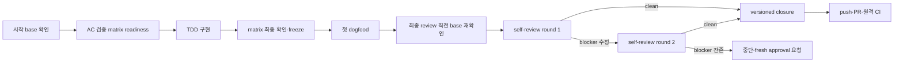

# 직군별 워크플로우 — 내 직군, 바로 실행

> 내 일에 localmind가 어떻게 쓰이는지 직군별 예제로 체감하기. 각 직군의 상황→활용→효과는
> 👉 [직군별 유즈케이스(19 페르소나)](../examples/use-cases.md), 모든 예제는 [examples/](../examples/).

`make up` 후 **내 직군 스크립트 하나만 돌리면** localmind 활용이 한 번에 체감됩니다. 전부 실행·검증됨.

| 그룹 | 바로 실행할 워크플로우 |
|---|---|
| **개발** | [백엔드](../examples/workflow-backend.py) · [프론트](../examples/workflow-frontend.mjs) · [앱/모바일](../examples/workflow-mobile-i18n.py) · [게임](../examples/workflow-game-content.py) |
| **데이터/ML** | [ML 엔지니어](../examples/workflow-ml-index.py) · [데이터 분석](../examples/workflow-data-analysis.py) |
| **품질·설계·운영** | [QA](../examples/workflow-qa-testcases.py) · [아키텍트](../examples/workflow-design-review.py) · [인프라/SRE](../examples/workflow-infra-runbook.mjs) |
| **비개발** | [PM](../examples/workflow-pm-spec.py) · [테크니컬 라이터](../examples/workflow-docs-draft.mjs) · [보안](../examples/workflow-security-triage.py) · [연구자](../examples/workflow-research-synthesis.mjs) |
| **콘텐츠** | [AI 글작성](../examples/workflow-ai-writer.py) · [유튜브 대본](../examples/workflow-youtube-script.py) · [유튜브 편집](../examples/workflow-youtube-edit.py) · [썸네일](../examples/workflow-thumbnail-copy.py) · [인플루언서](../examples/workflow-influencer-repurpose.py) |
| **1인 개발** | [풀스택 투어](../examples/workflow-solo-stack.sh) |

## 실제 플로우 예시 — 어떻게 쓰고, 무엇이 쌓이는지
실행 중인 스택에 그대로 태운 두 직군. 응답·저장 데이터 모두 **실제 출력**입니다.

**백엔드 개발자** — 로그 요약 → 분류(perf) → 대응 결정을 노트로 적재 → `NOTES_DIR`에 **.md 정본이 쌓임**(이후 검색·RAG 대상)


**기획자(PM)** — 결정을 `remember`로 mem0에 저장 → PRD 초안 → 2주 뒤 `recall`로 **의미 회상**(결정·이유가 **기억으로 쌓임**)


## Deep Research — 근거 기반 심층 조사

> **결론** — `deep-research`는 하나의 **공용 logical command ID**로 같은 근거 수집·교차검증·비판적
> 검수 절차를 실행하는 Agent Skills 워크플로입니다. 명시 호출로만 시작하는 `report-only` 작업이며,
> 기본 산출물은 외부 상태를 바꾸지 않는 결론 우선 채팅 보고입니다.

### 호출과 지원 범위

| 런타임 | 실제 호출 |
|---|---|
| Claude Code | `/deep-research <topic>` |
| Codex | `$deep-research <topic>` |
| Gemini CLI | auto skill 또는 생성된 `/deep-research <topic>` wrapper |

논리 ID와 조사 계약은 같지만 호출 문자는 런타임 공식 문법을 따릅니다. Codex의 bare
`/deep-research`는 공식 호출 문법이 아니므로 지원하거나 권장하지 않습니다. deprecated Custom
Prompts와 `/prompts:deep-research` 경로도 사용하지 않습니다.

이 기능은 벤더의 first-party Deep Research 제품과 **별개**입니다. 전용 backend·전용 모델·전용
서버를 복제하거나 같은 결과를 보장하지 않습니다. Agent Skills를 로드하는 호환 runtime에서 실행하는
워크플로이며, Agent Skills를 제공하지 않는 모델 단독 API나 모델만으로는 실행할 수 없습니다.

현재 정식 대상은 Claude Code·Codex·Gemini CLI입니다. Gemini CLI는 공용 Agent Skill discovery와
generated wrapper를 함께 제공합니다. Antigravity 전용 adapter 또는 정식 target 편입은 이번 범위
밖이며, 향후 별도 검증이 필요한 후속 작업입니다.

### 조사 흐름과 결과

1. 명시 호출과 주제를 확인합니다. 주제가 없거나 실행 provenance가 불명확하면 확인부터 받고,
   확인 전 source lookup·위임·write는 시작하지 않습니다.
2. 질문·목적·독자·기준일·포함/제외 범위·종료 조건을 research brief로 재진술해 확인받습니다.
3. 선행 문맥을 확인하고 T1/T2 우선 source strategy를 세운 뒤, 독립적인 질문만 read-only lane으로
   나눕니다.
4. claim별 evidence ledger에 URL·권위·날짜·지지/반박·확인 상태를 연결하고 상충 근거를 숨기지
   않습니다.
5. 모든 lane이 끝난 뒤 synthesis → final critic 순서로 검수하고, TL;DR·scope/기준일·핵심 발견·
   근거·상충/한계·권고·Open questions·실행 투명성 순서로 보고합니다.

행동과 형식의 정본은 [canonical skill](../templates/skills/deep-research/SKILL.md)과
[research contract](../templates/skills/deep-research/references/research-contract.md)입니다.

### Capability fallback과 실행 등급

- live source lookup이 없거나 미지원이면 결과를 `context-only` 또는 live verification unavailable로
  표시하고, 최신 사실은 미검증으로 남긴 채 현재 session에서 가능한 범위만 보고합니다.
- isolated delegation 또는 isolated critic이 없거나 미지원이면 current-session fallback으로 같은
  체크리스트를 수행하며 `not independent` 또는 비독립으로 표기합니다.
- 역할별 추상 등급은 source scout=`economy`, research coordinator=`standard`, evidence
  researcher=`standard`, research synthesizer=`critical-reasoning`, final critic=
  `critical-reasoning`입니다.
- 설치별 binding이 각 런타임에서 쓸 구체 model을 결정합니다. canonical workflow는 특정 모델명을
  소유하지 않습니다. final critic은 가용 모델이 부족해도 조용히 silent downshift하거나 더 낮은
  등급으로 대체하지 않으며, fallback과 실제 독립성 상태를 보고합니다.

## 페르소나/모델 바인딩 온보딩 (`localmind-binding`)

> 위 표의 워크플로우들과는 성격이 다른 절입니다 — "직군별 예제"가 아니라, `goal-ready`·
> `goal-impl`·`sdd-self-review` 같은 localmind의 AI 워크플로 스킬이 **실행 등급별로 어떤
> 모델을, 역할별로 어떤 페르소나를 쓸지**를 이 설치(런타임)에 맞게 정하는 온보딩 절차입니다
> (배포·스킬 전반은 [agents.md](agents.md) §5 참고).

### 무엇을 하는 스킬인가

`localmind-binding`은 AGENTS.md "실행 등급 배치"의 추상 등급 3종
(`critical-reasoning`·`standard`·`economy`) 각각에 쓸 구체 모델과, 역할(architect·critic·
worker 등)별로 위임할 페르소나를 확정하는 **온보딩·재설정 전용 스킬**입니다. 명시적으로
호출했을 때만 시작합니다(예: Claude Code에서 `/localmind-binding`).

1. 이 세션이 지금 돌고 있는 런타임을 스스로 파악해 식별자(runtime-id, 아래 표)를 보여주고
   확인받습니다.
2. 재설정이면 기존 바인딩을 요약해 보여주고 바꿀 항목만 고르게 합니다 — 손대지 않은 항목은
   그대로 보존합니다.
3. 등급별 모델 추천 초안을 제시합니다 — 예를 들어 Claude 계열 세션이라면 critical-reasoning에
   Opus 계열, standard에 Sonnet 계열, economy에 Haiku 계열 같은 식입니다. **이 추천은 세션의
   지식 시점에 따라 낡을 수 있으므로**, 실제로 저장되는 값은 어디까지나 그 자리에서 사용자가
   확정한 값입니다.
4. 페르소나 레지스트리(`~/.localmind/agents/`)를 나열해 역할별로 쓸 페르소나를 확정받습니다.
   페르소나 정의가 하나도 없으면 이 단계는 사유를 안내하고 건너뛰며, 등급 설정은 그대로
   이어집니다.
5. 레지스트리에 없는 페르소나 이름은 저장하지 않고 다시 고르게 합니다. 등급·역할 일부만
   채운 설정도 유효합니다(전부 채우도록 강요하지 않습니다).
6. 확정된 값을 저장하고, 무엇이 어떻게 저장됐는지 평이한 말로 요약해 보여줍니다.

### 저장 위치 — 런타임별 로컬 파일, 백업 제외

바인딩은 `~/.localmind/_bindings/<runtime-id>.json`에 **런타임(설치)당 파일 하나**로
저장됩니다(노트 폴더를 옮겼다면 첫 노트 폴더 아래). 파일명 접두 `_`는 이 저장소의 "기본
로컬·미커밋" 컨벤션이며, `_bindings/`는 `make backup`의 gitignore 시드 목록에 포함돼 **백업
저장소에 커밋되지 않습니다** — 실행 등급별 모델 선호는 기기·설치마다 다를 수 있는 로컬
설정이기 때문입니다.

### 왜 런타임마다 따로 설정하나

같은 컴퓨터 안에서도 Claude Code·Codex CLI·Gemini CLI처럼 런타임(설치)마다 **실제로 쓸 수
있는 모델의 종류·이름이 다릅니다.** 한 런타임에서 확정한 등급→모델 매핑을 다른 런타임에
그대로 옮기면 존재하지 않는 모델을 가리키게 될 수 있어, 온보딩은 설치마다 별도 파일로
분리하고 서로의 값을 대신 읽지 않습니다. 같은 종류의 런타임이라도 다른 컴퓨터에 새로
설치했다면 그 설치에서 다시 한 번 온보딩을 실행해야 합니다 — 이 "격리"는 오류가 아니라
의도된 설계입니다.

### runtime-id 정규 표

온보딩은 세션이 스스로 자기 런타임을 판단해 소문자 kebab-case 식별자를 제안하고 사용자
확인을 받습니다. 표기가 흔들리기 쉬운 지점이라 알려진 런타임의 권장 id를 아래에 고정합니다
— 온보딩 세션이 아래와 다른 id를 제안하면 이 표의 값으로 정정해 확인하세요:

| 런타임(설치) | 권장 runtime-id |
|---|---|
| Claude Code | `claude-code` |
| Codex CLI | `codex` |
| Gemini CLI | `gemini-cli` |

위 표에 없는 런타임(향후 추가되는 Agent Skills 호환 도구 등)은 제품명을 소문자 kebab-case로
바꾼 값을 그대로 씁니다. 애매하면 세션이 추측하지 않고 사용자에게 직접 물어 확정합니다.

## SDD 구현 검증 — 증거를 먼저 고정하고 유한하게 닫기

> **결론** — `goal-impl`은 구현 전에 최신 base를 확인하고, 모든 AC의 검증 방법·evidence·종료
> 조건을 준비합니다. 첫 dogfood 직전에 그 범위를 동결한 뒤 실제 실행과 최대 2회의 자동
> self-review로 검증합니다. blocker가 남으면 성공으로 낮춰 부르지 않고 사용자에게 보고해
> 멈추며, push 이후 PR/CI의 동적 상태는 원격 시스템이 정본입니다.



### 1. 쓰기 전에 base와 검증 가능성을 확인합니다

첫 파일을 고치기 전에 repository가 정한 remote base를 조회해 확인 시각과 **full SHA**를 남기고,
latest base에서 분리된 feature branch인지 확인합니다. 기존 dirty·unmanaged 자산은 보존하며 작업
대상과 겹치면 고치지 않고 멈춥니다.

같은 readiness 단계에서 `plan.md`의 verification matrix도 확인합니다. spec의 모든 AC는 정확히
한 행이어야 하며, 각 행은 다음 다섯 칸을 빠짐없이 가집니다.

| AC | 검증 방법·레벨 | 최소 evidence | 통과·종료 조건 | 상태 |
|---|---|---|---|---|
| 예: AC-1 | 계약 테스트 + 실제 실행 | 테스트 로그와 관찰 기록 | 필수 테스트 green + 기대 상태 관찰 | Pending |

필수 도구나 환경이 없어 검증할 수 없다면 `skipped`나 간이 검증을 green으로 바꾸지 않고
**blocker**로 보고합니다. 이 matrix는 `goal-ready`에서 작성·확인하고 `goal-impl`이 readiness를
재검사합니다.

### 2. 첫 dogfood 직전에 matrix를 동결합니다

구현 중 발견한 내용을 matrix에 반영한 뒤, **첫 dogfood 바로 직전** 검증 방법·최소 evidence·종료
조건을 최종 확인하고 freeze합니다. 이 시점부터 단순히 “이런 증거도 있으면 좋겠다”는 새 선호는
현재 작업의 blocker가 아니라 advisory 또는 후속 과제입니다. 그래야 검수할 때마다 증거 요구가
늘어나 dogfood가 끝나지 않는 일을 막을 수 있습니다.

동결은 실제 결함을 숨기는 장치가 아닙니다. 재현된 제품·보안 결함은 언제나 blocker입니다. 기존
종료 조건이 틀렸다고 입증되면 변경 이유·영향받는 AC·무효가 되는 evidence를 먼저 기록하고 해당
검증을 다시 실행합니다. 새로운 요구나 AC라면 사용자 확인 후 spec→plan→matrix 순서로 먼저
고칩니다.

### 3. 최종 review 직전 base를 다시 확인합니다

dogfood와 테스트가 끝나면 self-review를 시작하기 **직전** 같은 remote base의 full SHA를 다시
조회합니다. base가 전진했으면 repository 정책에 따라 정합·통합하고, 영향받는 필수 regression을
다시 green으로 만든 뒤에야 review round 1을 시작합니다.

remote가 없거나 조회·통합에 실패하면 상태를 **`freshness unverified`**로 표시하고 기준 SHA·원인·
영향을 설명합니다. 이때는 fresh 또는 complete라고 단정하지 않으며, 사용자의 방향을 받기 전에
다음 단계로 가지 않습니다.

### 4. 자동 self-review는 최대 두 round입니다

review하는 코드·계약·필수 evidence 한 세대가 **candidate**입니다. 같은 candidate를 격리 reviewer
여러 명이 살펴도 findings를 합친 merged report 하나가 round 하나입니다. finding이나 실제 CI 결함을
고쳐 candidate가 달라지고 새 merged report를 만들 때만 다음 round로 셉니다.

- round 1이 clean이면 종료합니다. blocker를 고쳤을 때만 변경된 candidate로 round 2를 자동 실행합니다.
- round 2에도 blocker가 남으면 성공 처리하지 않습니다. 남은 findings·수정·테스트 상태와 다음
  review 목적을 보고하고 멈춥니다.
- 그 보고 뒤 사용자가 명시한 **fresh round approval 1개는 다음 round 1개만** 허용합니다. 실행하면
  승인은 소진되며, 추가 round에도 blocker가 남으면 새 승인을 다시 받아야 합니다.

이는 자동 반복 횟수의 상한이지 품질 하향이 아닙니다. blocker·미충족 AC·실패한 필수 테스트가
하나라도 있으면 완료할 수 없습니다. 이 규칙은 `goal-impl` 구현 self-review에 적용되며,
`goal-ready` 문서 critic과 Deep Research final critic은 각자의 독립된 종료 계약을 따릅니다.

### 5. commit으로 닫을 상태와 원격 상태를 분리합니다

최종 commit 전에 확정할 수 있는 코드·테스트·문서·publish handoff 준비가 **versioned completion
state**입니다. tracked task checkbox는 여기까지만 닫습니다. push 뒤 생기는 PR 번호·review·CI run과
성공/실패는 **external completion state**이며 repository가 정한 원격 PR/CI 시스템을 SSoT로 삼습니다.

따라서 PR 번호나 CI 성공 상태만 기록하려는 후속 commit, 또는 external task를 `[x]`로 바꾸기 위한
commit은 만들지 않습니다. CI가 실제 결함을 찾았다면 예외적으로 코드를 고칠 수 있지만, 그것은
새 candidate입니다. 관련 테스트를 다시 통과하고 남아 있는 round 예산 또는 새 fresh approval에
따른 review를 거친 뒤 commit하며, 새 head의 원격 CI가 다시 정본이 됩니다.

## SDD 병렬 오케스트레이션 — tasks 하나로 여러 worker 동시에 (specs/052)

> `goal-impl`은 `tasks.md`의 phase 선언을 읽어 **의존 DAG**를 세우고, 조건이 맞으면 여러
> worker를 **한 메시지에 동시에** 띄웁니다. `goal-ready`(문서 작성)도 자기만의 병렬 규칙이
> 있는데, 코드 구현과는 다른 체제입니다. 이 절은 이 두 체제를 사람이 읽고 이해하기 위한
> 설명이며, 행동 정본은 `templates/skills/goal-impl/SKILL.md` §4A와
> `templates/skills/goal-impl/references/tasks-format.md`입니다.

### 선언 문법 — phase 헤더 바로 아래 한 줄

`tasks.md`의 각 phase 헤더 아래에 `depends-on:`·`files:` 선언을 blockquote로 둡니다:

```markdown
## Phase 1 — tasks-format 규약 정본 신설 (worker)
> depends-on: 없음 · files: `templates/skills/goal-impl/references/tasks-format.md`

## Phase 3 — 문서 작성 스킬 곁가지 병렬 절 (worker)
> depends-on: 없음 · files: `templates/skills/goal-ready/SKILL.md`

## Phase 2 — 구현 스킬 fan-out 절 (worker)
> depends-on: Phase 1 · files: `templates/skills/goal-impl/SKILL.md`
```

`depends-on`은 선행 phase를, `files`는 그 phase가 건드릴 저장소 상대 경로를 선언합니다.
선언이 없는 phase(레거시 tasks 문서)는 자동으로 "모든 노드와 겹침"으로 취급돼 직렬로
돌아갑니다 — 안전 쪽으로 기본값이 잡혀 있습니다.

### fan-out 레이어 — 의존 DAG를 배리어로 나누기

메인은 선언을 읽어 **의존이 모두 끝났고, 파일이 서로 겹치지 않고(disjoint), 각자 유의미한
크기인 노드**만 골라 같은 레이어로 묶어 동시에 spawn합니다. 이 저장소 자신의 052 구현이
실제 예시입니다:

| 레이어 | 내용 | 왜 이렇게 묶였나 |
|---|---|---|
| L1 | Phase 1 ∥ Phase 3 | 둘 다 의존 없음 + 편집 파일이 완전히 다름(disjoint) |
| L2 | Phase 2 | Phase 1이 확정한 문법을 참조 — Phase 1 배리어를 통과할 때까지 대기 |
| L3 | Phase 4 ∥ Phase 5 | 둘 다 Phase 1~3에 의존하지만 서로는 disjoint(`skill-contract.test.ts` vs `AGENTS.md`+`docs/workflows.md`) |
| L4 | Phase 6 | 나머지 전부에 의존, 곁가지 없이 직렬로 완주 |

레이어가 끝나면(**배리어**) 메인이 전체 테스트·빌드로 통합 검증하고 커밋한 뒤에야 다음
레이어를 풉니다. worker끼리는 서로 직접 통신하지 않습니다 — 결과는 항상 메인을 거칩니다.

**잔task는 묶어서 하나로**: Phase 5처럼 각각은 유의미한 크기에 못 미치는 작업(`AGENTS.md`
포인터 1~2줄 + `docs/workflows.md` 예시 하나)이 여럿 있으면, 개별 병렬 spawn 대신 **단일
worker 하나가 묶어서** 처리합니다 — worker 결과가 메인 컨텍스트로 돌아오는 고정 비용이
작업 자체보다 커지는 것을 막기 위해서입니다.

### 두 체제 — 코드 구현(`goal-impl`)과 문서 작성(`goal-ready`)는 다르다

| | `goal-impl`(코드 구현) | `goal-ready`(goal/spec/plan 작성) |
|---|---|---|
| 병렬 단위 | tasks의 phase(위 선언 문법) | 슬라이스 안 곁가지, 슬라이스 간 문서 |
| 충돌 판정 | files 선언의 disjoint 여부 | 대체로 불필요 — 저작이 Read 전용이라 파일을 직접 안 씀 |
| 병렬 한계 | 파일 겹침 → 직렬(worktree는 명시 선택 시만) | 내용·결정 의존만(예: 뒤 슬라이스가 앞 결정을 전제하면 대기) |
| 항상 직렬인 구간 | 없음(단 disjoint **+ 유의미한 크기 + 의존 충족**이어야 병렬 후보 — 잔task는 묶음) | 한 슬라이스 안 goal→spec→plan→tasks 하드 체인 |
| 마지막 배리어 | 메인의 통합 검증(테스트·빌드) | 크리틱 — 모든 곁가지 산출물이 모인 뒤에만 |

코드 구현 쪽은 여러 worker가 **같은 코드트리를 공유**하기 때문에 파일 충돌 판정이 핵심이고,
문서 작성 쪽은 저작이 읽기 전용이라 그 절차가 대체로 필요 없습니다 — 대신 "이 결정이 저
결정을 전제하는가"만 따집니다.

### 위상 — 메인이 유일한 오케스트레이터(hub-and-spoke)

메인이 **hub**, 서브에이전트(worker)는 **leaf**입니다. worker는 자기가 맡은 phase의 파일만
고치고, 다른 worker를 spawn하거나 서로 통신하지 않습니다. 무거운 작업은 worker에게
넘기고(새 컨텍스트로 오프로드), 값싼 조회·검증은 메인이 직접 도구를 병렬 실행합니다.
worker가 또 다른 worker를 spawn하는 중첩 위임은 기본적으로 막혀 있고, 사용자가 특정
사안에 명시적으로 허락했을 때만 한 단계까지 예외를 둡니다.
